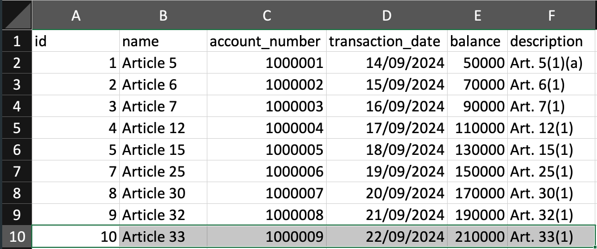

## Reconciliation Django API
To get started, clone this repository, `cd` in to the directory and follow the instruction:

1. Open the `.env` file and update the database variables with yours
2. Run the commands below:
```bash
#install dependencies
pip install -r requirements.txt

#run migration
python manage.py migrate

#start server
python manage.py runserver
```

Open [http://localhost:8000](http://localhost:8000) with your browser to see the result.

## Endpoints
1. `GET - api/v1/upload` - list uploads
2. `POST - api/v1/upload` - upload new file
3. `GET - api/v1/upload/:id` - view uploaded record by id

## Allowed CSV sample file

